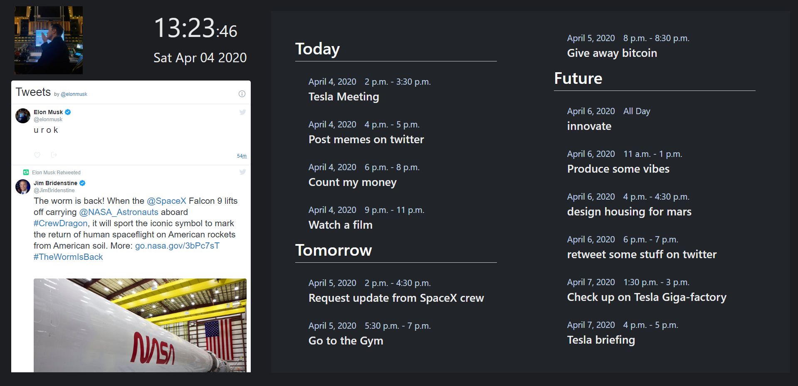
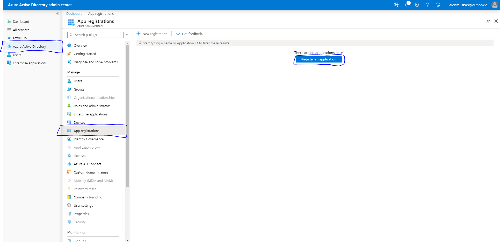
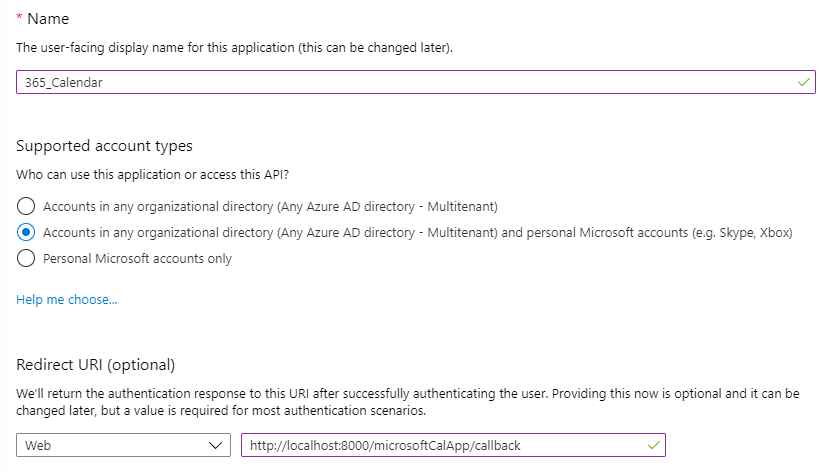
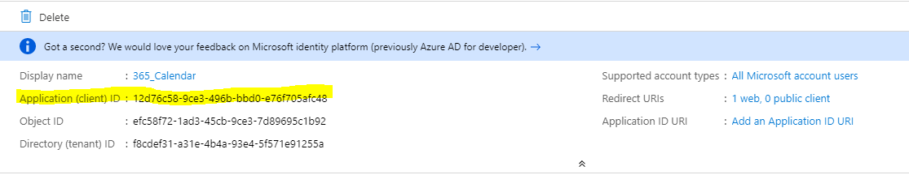
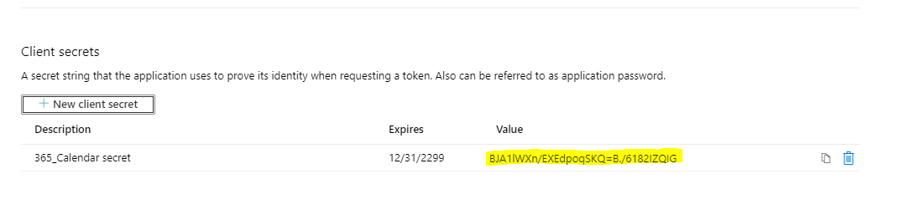

# 365-calendar
A dashboard which displays your Microsoft 365 calendar




# Install
After The repo has been cloned, cd into the directory and download the needed dependencies:
```
pip install Django==3.0
pip install requests_oauthlib==1.3.0
pip install pyyaml==5.2
pip install python-dateutil==2.8.1
```
use the `python manage.py migrate` command to make sure the database is initialised


To run the Django server use:
```
python manage.py runserver
```
navigate to `http://localhost:8000/microsoftCalApp/` to make sure it is working but do not sign in yet as we need to register an app with Azure


# [Registering the app](https://aad.portal.azure.com/)
click on this [link](https://aad.portal.azure.com/)

Log in with the Microsoft account that you want your calendar to be displayed from.


Click on **Azure Active Directory** then **App registrations** then **register an application**




Name the application whatever you want you can change it later. 
Check the box that says:
- [x] **Accounts in any organizational and personal Microsoft accounts**

Make sure the **Redirect URL** is set to `web` and the URL being `http://localhost:8000/microsoftCalApp/callback`




Select **Register** and copy the value of the **Application (client) ID** and save it for later




Next, select **Certificates & secrets** then select **New client secret**. Enter a value for description and select an expiry time (You will need to update the secret if you don't chose forever)


Add the secret then **copy its value** and save it for later




Lastly, open your cloned folder and navigate to the `oauth_settings.yml` file which is in the first microsoft_calendar folder
- enter your **Application (client) ID** where is says YOUR_APP_ID_HERE
- enter your **client secret** where is says YOUR_APP_PASSWORD_HERE

**save the file** then re-run the server (`python manage.py runserver`)

login to your Microsoft account then click on App in the nav-bar

# Twitter

Hold on! Why cant i see twitter?

click on this [link](https://publish.twitter.com/#) then enter th twitter url you want displayed then copy the code generated

go to the cloned folder and navigate to `365-calendar\microsoft_calendar\microsoftCalApp\templates\microsoftCalApp` then open the calendarApp file

paste in the twitter code under where is says `<!------------Put twitter tag under here------------>` (line 50)

# Refrences
Hope this guide helped 

check out [the original microsoft post on how to build Python apps with Microsoft Graph](https://docs.microsoft.com/en-us/graph/tutorials/python) This guide really helped me when originally making this project.
